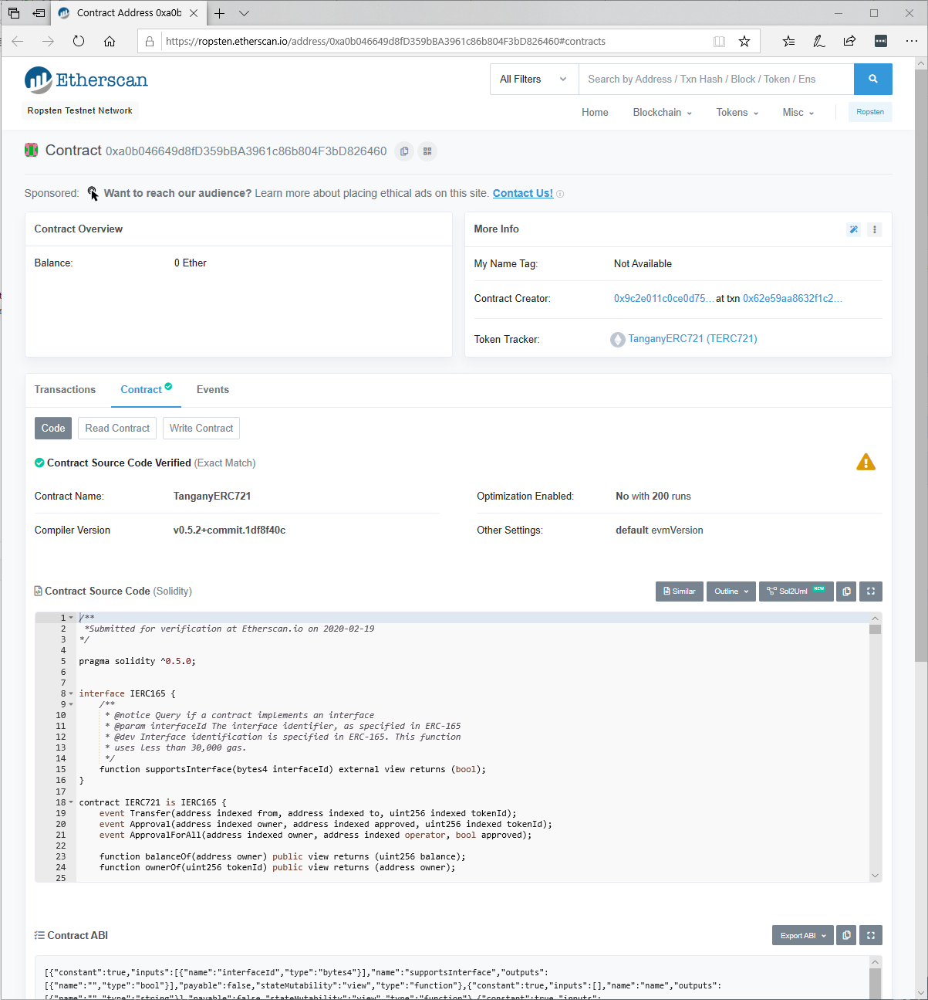

<div align="center">  
  <a href="https://tangany.com">  
      
  </a>  
  <h1>Truffle blueprint</h1>      
  <p>  
    <strong>Easy boilerplate for deploying openzeppelin based smart-tokens using the truffle suite</strong>  
  </p>  
  <br/>  
</div>  

# Development

Modify the a token blueprint (e.g. [./contracts/TanganyERC20.sol](contracts/TanganyERC20.sol)) to deploy the token.  Make sure the contract file name is referenced correctly in [./migrations/2_deploy_contract.js](./migrations/2_deploy_contract.js)

## Environment Variables

Each deployment environment has a different set of mandatory environment variables. Add the secrets required for the deployment environment to [.env](./.env)

Make sure to provide the 64 character long hexa-decimal `PRIVATE_KEY`. The associated address will inherit the tokens created by the contract deployment.

# Deployment

Sign up for a free api key at https://infura.io/dashboard to deploy to public networks. Make sure the private key on ropsten has enough ether to fund the deployment transaction. 

Get free ether from a ropsten ethereum faucet https://faucet.ropsten.be/

Deploy the smart contract to the desired environment with the provided commands (e.g. `npm run deploy:ropsten`). The address of the deployed contract will be printed to the console output:

````

C:\www\tangany-test-token>npm run build && npm run deploy:development

> tangany-test-token@1.0.0 prebuild C:\www\tangany-test-token
> rimraf ./build/contracts/*


> tangany-test-token@1.0.0 build C:\www\tangany-test-token
> truffle compile


Compiling your contracts...
===========================
> Compiling .\contracts\Migrations.sol
> Compiling .\contracts\TanganyTestToken.sol
> Compiling openzeppelin-solidity/contracts/token/ERC20/ERC20.sol
> Compiling openzeppelin-solidity/contracts/token/ERC20/ERC20Detailed.sol
> Compiling openzeppelin-solidity\contracts\math\SafeMath.sol
> Compiling openzeppelin-solidity\contracts\token\ERC20\IERC20.sol
> Artifacts written to C:\www\tangany-test-token\build\contracts
> Compiled successfully using:
   - solc: 0.5.2+commit.1df8f40c.Emscripten.clang


> tangany-test-token@1.0.0 deploy:development C:\www\tangany-test-token
> truffle migrate --network development


Compiling your contracts...
===========================
> Everything is up to date, there is nothing to compile.


Starting migrations...
======================
> Network name:    'development'
> Network id:      5777
> Block gas limit: 6721975


1_initial_migration.js
======================

   Deploying 'Migrations'
   ----------------------
   > transaction hash:    0x7d67cffd0ca19b0d8065c129510926b30a3ddd2dcdae339ebd4d07b32176a57c
   > Blocks: 0            Seconds: 0
   > contract address:    0x63A1ca2131B660D0388d15494eBE916d178C9e87
   > account:             0xc460f0A72A5860107F2606321401f07549Bb4ddA
   > balance:             99.99453676
   > gas used:            273162
   > gas price:           20 gwei
   > value sent:          0 ETH
   > total cost:          0.00546324 ETH


   > Saving migration to chain.
   > Saving artifacts
   -------------------------------------
   > Total cost:          0.00546324 ETH


2_deploy_contract.js
====================

   Deploying 'TanganyTestToken'
   ----------------------------
   > transaction hash:    0xa5283e240886d3955f03af44e1115985e6ea131fe1538f755719f02fb0f3497a
   > Blocks: 0            Seconds: 0
   > contract address:    0x08D65FFaAA99a54a98AED475f5c9d659eF60CA7b
   > account:             0xc460f0A72A5860107F2606321401f07549Bb4ddA
   > balance:             99.96902082
   > gas used:            1233769
   > gas price:           20 gwei
   > value sent:          0 ETH
   > total cost:          0.02467538 ETH


   > Saving migration to chain.
   > Saving artifacts
   -------------------------------------
   > Total cost:          0.02467538 ETH


Summary
=======
> Total deployments:   2
> Final cost:          0.03013862 ETH
````

In this example the smart contract was deployed to the address `0x08D65FFaAA99a54a98AED475f5c9d659eF60CA7b` on the Ganache Development network. The address `0xc460f0A72A5860107F2606321401f07549Bb4ddA` gained ownership to the smart contract and received 10000 tokens.

## Development network / Ganache 
Required environment variables
* PRIVATE_KEY

```
npm run build && npm run deploy:development
```

## Private network 
Required environment variables
* PRIVATE_KEY
* PRIVATE_NETWORK_URL
* PRIVATE_NETWORK_ID

Also make sure to verify the [truffle settings](./truffle-config.js) for `private` match the actual private network (gas, gasPrice, ...)

```
npm run build && npm run deploy:private
```

## Ropsten public testnet 
Required environment variables
* PRIVATE_KEY
* INFURA_KEY

## Verification
In order to verify your smart contract on etherscan.io execute the verification script immediately after the contract is successfully deployed and pass the contract name as the argument (e.g. `npm run verify:ropsten -- TanganyERC20`). 
This action supports smart contracts deployed on public Ethereum networks and does require the `ETHERSCAN_APIKEY` environment variable to execute. The API key that can be generated for free at https://etherscan.io/myapikey. 



***
<div align="center">
<p>   
  
</p>
<p>
© 2019 <a href="https://tangany.com">Tangany</a>
</p>
<p>
 <a href="https://tangany.com/imprint/">Imprint</a>
• <a href="https://tangany.com/imprint/">Privacy policy</a>
• <a href="https://tangany.com#newsletter">Newsletter</a>
• <a href="https://twitter.com/tangany_wallet">Twitter</a>
• <a href="https://www.facebook.com/tanganywallet">Facebook</a>
• <a href="https://www.linkedin.com/company/tangany/">LinkedIn</a>
• <a href="https://www.youtube.com/channel/UCmDr1clodG1ov-iX_GMkwMA">YouTube</a>
• <a href="https://github.com/Tangany/">Github</a>
</p>
</div>
